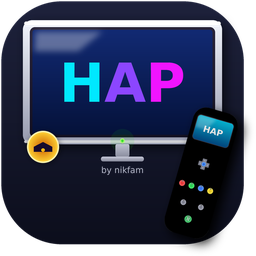
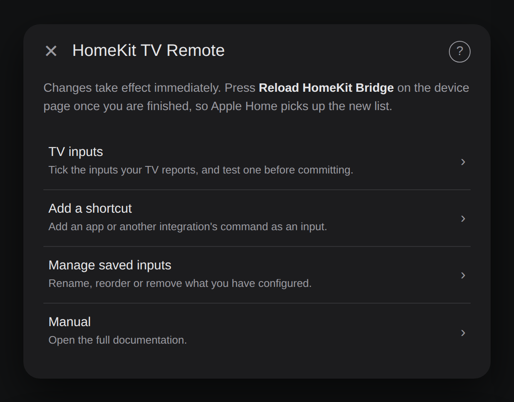
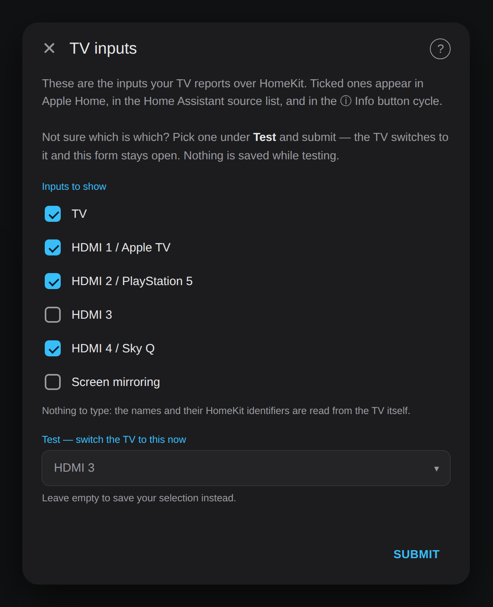
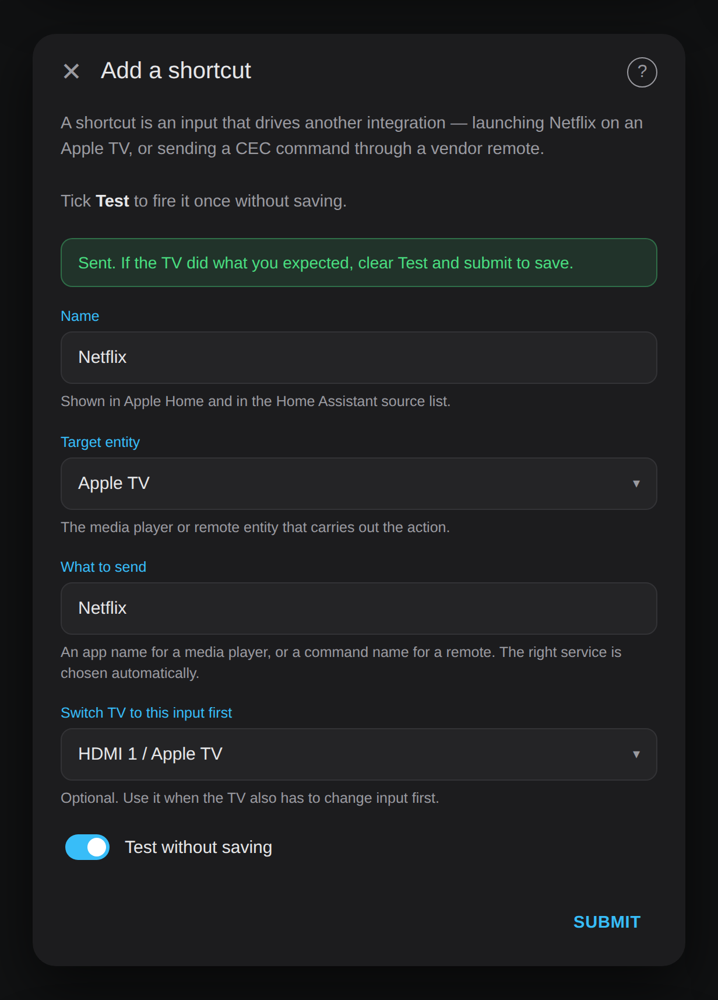
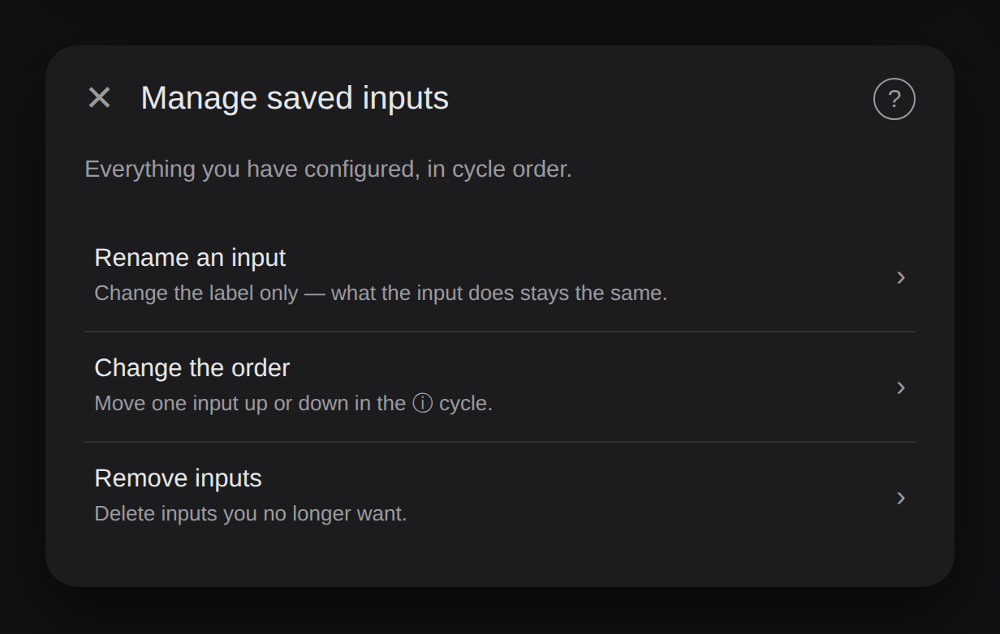
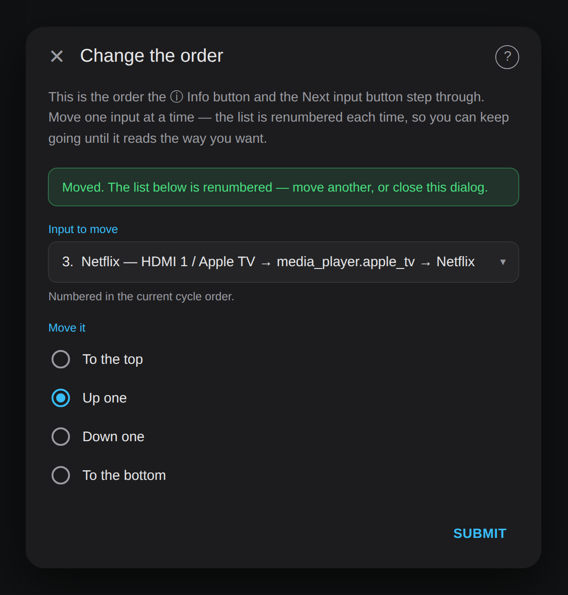
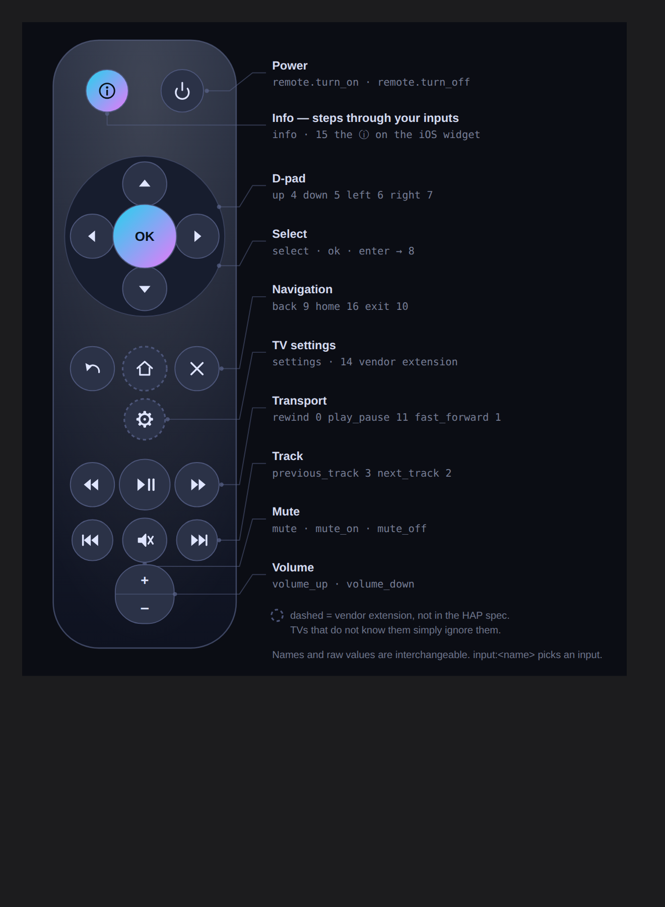

<p align="center">
  
</p>

<h1 align="center">HomeKit TV Remote</h1>

<p align="center">
  Control your TV over HAP — the same protocol Apple devices use — for a native Home Assistant
  remote entity and the full iOS/iPadOS remote widget in Control Center.
</p>

<p align="center">
  <a href="https://github.com/hacs/integration"></a>
  <a href="https://github.com/nikf86/homekit-tv-remote/releases"></a>
  <a href="https://github.com/nikf86/homekit-tv-remote"></a>
</p>

---

## What it does

- **Full remote over HAP.** D-pad, select, back, exit, play/pause, transport keys, volume, mute and input switching, written straight onto your TV's HomeKit characteristics. No vendor app, no IP remote — the same channel and the same priority as an Apple device.
- **The iOS remote widget, with input cycling.** Your TV appears as a Television accessory in Apple Home, which unlocks the Control Center remote. The ⓘ Info button steps through your chosen inputs — the one thing Apple's widget otherwise can't do.
- **Any input, any integration.** Your TV's own inputs come from the TV itself; you just tick the ones you want. Everything else — Apple TV apps, Bravia apps, vendor CEC commands — is a shortcut you add in one form.
- **Test before you commit.** Both the TV inputs screen and the shortcut form can fire a command once, without saving.

**It never asks the TV what it's doing.** Power state and current input come from the HomeKit Device entity Home Assistant already keeps up to date; input numbers come from the accessory description already held in memory. The TV only ever receives.

---

## Requirements

| | |
|---|---|
| Home Assistant | 2026.8 or later |
| Your TV | paired through the [HomeKit Device](https://www.home-assistant.io/integrations/homekit_controller/) integration |
| For the iOS widget | [HomeKit Bridge](https://www.home-assistant.io/integrations/homekit/) configured |

---

## Install

**HACS** — add this repo as a custom repository (category: Integration), install, restart, then **Settings → Devices & Services → Add Integration → HomeKit TV Remote**.

**Manual** — copy `custom_components/homekit_tv_remote/` into `config/custom_components/` and restart. Copy the whole folder, **including `translations/`** — without it every dialog renders with no text.

---

## Setup in four steps

**1. Add the integration.** Pick your paired TV and give it a name. `Sony TV` produces `remote.sony_tv` and `media_player.sony_tv`.

**2. Expose the media player to HomeKit Bridge in accessory mode.** This is what gives you the iOS widget — bridge mode will not.

```yaml
homekit:
  - name: Sony TV
    mode: accessory
    filter:
      include_entities:
        - media_player.sony_tv
```

Restart Home Assistant and pair the new accessory in Apple Home.

**3. Choose your inputs** in **Configure** (below).

**4. Press Reload HomeKit Bridge** on the device page, then force-close and reopen the Apple Home app.

---

## The Configure dialog

Everything lives in one place: **Settings → Devices & Services → HomeKit TV Remote → Configure**. Changes take effect the moment you submit — no reload, no waiting.

<p align="center"></p>

### TV inputs

Your TV's real inputs, already listed. Tick the ones you want in Apple Home, the Home Assistant source list, and the ⓘ cycle.

Not sure whether *HDMI 3* is the Xbox or the soundbar passthrough? Pick it under **Test** and submit — the TV switches to it and the form stays open. Nothing is saved while testing.

<p align="center"></p>

There is nothing to type and no identifier numbers to look up. The integration reads each input's name and its HomeKit identifier straight from the accessory.

### Add a shortcut

An input that drives another integration instead of the TV's own input switch.

| Field | What it is |
|---|---|
| **Name** | What you see in Apple Home and in `source_list` |
| **Target entity** | Any `media_player.*` or `remote.*` entity, from any integration |
| **What to send** | An app name for a media player, or a command name for a remote |
| **Switch TV to this input first** | Optional — when the TV must also change input, e.g. to the Apple TV's HDMI port |
| **Test** | Fires it once without saving, and reports back in the form |

<p align="center"></p>

> **There is no Apple TV switch any more.** When the target is a media player, the integration checks that entity's own `source_list` at the moment the shortcut runs: if your app name is in it, the app is launched with `select_source`; otherwise with `play_media`. That's correct for Apple TV, for Bravia, and for anything else, without you flagging it.

### Manage saved inputs

<p align="center"></p>

**Rename** changes the label only. What the input does, and where it sits in the cycle, are untouched. The form comes back after each rename so you can do several.

**Change the order** moves one input at a time — to the top, up one, down one, to the bottom. The list is renumbered every time, so you can keep nudging until it reads the way you want. This is the order the ⓘ button and the Next input button step through.

<p align="center"></p>

**Remove** deletes inputs. Nothing is pre-ticked, so submitting as-is changes nothing.

---

## Worked example: Apple TV

The most common setup, end to end. Assume the Apple TV is on HDMI 1 and the Apple TV integration is paired with the Companion protocol.

**A shortcut that launches an app and switches the TV to it:**

| Field | Value |
|---|---|
| Name | `Netflix` |
| Target entity | `media_player.apple_tv` |
| What to send | `Netflix` |
| Switch TV to this input first | `HDMI 1 / Apple TV` |

Press ⓘ until it lands on *Netflix* and the TV changes input and opens the app in one step.

**App only, no input switch** — use this when the TV is already on the Apple TV, or you handle input elsewhere. Same as above, leave *Switch TV to this input first* empty.

### App names

App names are **case-sensitive and must match exactly**. They are whatever your Apple TV reports, so the reliable way to get them is:

**Developer Tools → Actions → `media_player.select_source`** → pick your Apple TV entity → the source dropdown lists every installed app with the exact string.

Commonly seen names, as a starting point:

| | | |
|---|---|---|
| `Netflix` | `Disney+` | `Prime Video` |
| `YouTube` | `Apple TV` | `Music` |
| `Max` | `Paramount+` | `Hulu` |
| `Plex` | `Spotify` | `Twitch` |
| `Photos` | `App Store` | `Settings` |

Region matters. `Prime Video` is `Amazon Prime Video` on some tvOS versions, `Max` was `HBO Max`, and local broadcasters (`ARD Mediathek`, `ZDFmediathek`, `BBC iPlayer`, `ITVX`) appear only where they're installed. Always confirm against the dropdown.

> **Why `select_source` and not `play_media`?** The Apple TV integration only supports launching apps through `select_source`. The integration works this out for you by checking whether your app name appears in the Apple TV's own source list — which it will, because that list *is* the installed apps.

---

## Worked example: other integrations

Any entity that exposes `media_player.select_source`, `media_player.play_media` or `remote.send_command` can be a shortcut target.

**Sony Bravia — launch an app**

| Field | Value |
|---|---|
| Name | `YouTube` |
| Target entity | `media_player.bravia_kd_55xg9505` |
| What to send | `YouTube` |

**Sony Bravia — send a vendor remote command (CEC input, etc.)**

| Field | Value |
|---|---|
| Name | `Portal CEC` |
| Target entity | `remote.bravia_kd_55xg9505` |
| What to send | `Hdmi2` |
| Switch TV to this input first | `HDMI 2` |

**Android TV / Google TV box — launch an app by package**

| Field | Value |
|---|---|
| Name | `Disney+` |
| Target entity | `media_player.shield` |
| What to send | `com.disney.disneyplus` |
| Switch TV to this input first | `HDMI 3` |

---

## Which TVs have HomeKit, and what to pair them with

Your TV must be pairable through **HomeKit Device** for this integration to exist at all. Beyond that, most of these brands also have their own Home Assistant integration, which is what you'd use as a *shortcut target* for apps and vendor commands the HAP protocol can't reach.

| TV brand | HomeKit built in | Best Home Assistant integration for shortcuts | Good shortcut targets |
|---|---|---|---|
| **LG** (webOS) | 2019 and later | [LG webOS TV](https://www.home-assistant.io/integrations/webostv/) | apps by name, vendor remote buttons |
| **Samsung** | 2019 and later | [Samsung Smart TV](https://www.home-assistant.io/integrations/samsungtv/) | apps, key commands |
| **Sony** (Android/Google TV) | 2019 and later | [Android TV Remote](https://www.home-assistant.io/integrations/androidtv_remote/) — or [Sony Bravia TV](https://www.home-assistant.io/integrations/braviatv/) on older sets | apps, input commands |
| **Vizio** (SmartCast) | 2016 and later | [VIZIO SmartCast](https://www.home-assistant.io/integrations/vizio/) | apps, inputs |
| **Roku TV** (TCL, Hisense, Philips…) | 2019 and later | [Roku](https://www.home-assistant.io/integrations/roku/) | channels/apps, remote keys |
| **Philips** (non-Roku) | varies by line | [Philips TV](https://www.home-assistant.io/integrations/philips_js/) | apps, ambilight |
| **Amazon Fire TV Edition** | 2019 4K models | [Android Debug Bridge](https://www.home-assistant.io/integrations/androidtv/) | apps by package |

Set-top boxes are usually the more useful shortcut target anyway:

| Box | Integration | Notes |
|---|---|---|
| **Apple TV** | [Apple TV](https://www.home-assistant.io/integrations/apple_tv/) | `select_source` launches apps; needs Companion pairing |
| **Nvidia Shield / Google TV** | [Android TV Remote](https://www.home-assistant.io/integrations/androidtv_remote/) | apps by package name |
| **Roku box / stick** | [Roku](https://www.home-assistant.io/integrations/roku/) | apps by name |

> Brand and year coverage moves around, and a set that does AirPlay 2 doesn't always do HomeKit. The honest test is the one that matters: if the TV shows up in **HomeKit Device**, you're in business.

---

## Entities

Six entities, one device page.

| Entity | What it does |
|---|---|
| `remote.<name>` | The command layer — `remote.turn_on`, `remote.turn_off`, `remote.send_command` |
| `media_player.<name>` | What you expose to HomeKit Bridge. Power, volume, mute, play/pause, source select |
| **Next input** | Steps the cycle forward — same action, same position, as the widget's ⓘ button |
| **Reload HomeKit Bridge** | Re-registers the accessory so Apple Home picks up a changed input list |
| **Debug listen** | Logs everything read from the HomeKit Device entity, tagged `[HOMEKIT_TV_LISTEN]` |
| **Debug send** | Logs every command written to the TV, tagged `[HOMEKIT_TV_SEND]` |

Both debug switches take effect immediately, log at warning level so they need no logger configuration, and survive a restart.

**Useful attributes.** On `remote.<name>`: `current_source` (the raw HomeKit input name), `is_muted`, `tv_inputs` (the full name → identifier map — invaluable when something won't switch), and `last_hap_error` after a failure. On `media_player.<name>`: `tv_source`, the raw HomeKit name of the active input even when it isn't one you configured.

---

## Commands

<p align="center"></p>

The same drawing is inside the integration, under **Configure → HAP commands**.

`remote.send_command` accepts any of these.

| Command | Does |
|---|---|
| `up` `down` `left` `right` | D-pad |
| `select` / `ok` / `enter` | Select |
| `back` · `exit` | Back · Exit |
| `play_pause` / `play` / `pause` | Play/pause |
| `rewind` `fast_forward` `next_track` `previous_track` | Transport |
| `info` · `home` · `settings` | Info · TV Home · TV Settings |
| `volume_up` / `volume_down` | Volume (`vol_up` / `vol_down` also work) |
| `mute` · `mute_on` · `mute_off` | Toggle · force on · force off |
| `input:Apple TV` | Switch to a TV input **by name** |
| `input_9` / `hdmi_9` | Switch to a TV input by HomeKit identifier |
| `4` `5` `6` `7` `8` `9` `10` `11` `15` | Raw HAP RemoteKey values |

Raw values: 0 rewind · 1 fast forward · 2 next · 3 previous · 4–7 up/down/left/right · 8 select · 9 back · 10 exit · 11 play/pause · 15 info. `14` (settings) and `16` (home) are vendor extensions — they work on Sony; TVs that don't know them ignore them.

`mute` is optimistic: HomeKit doesn't report mute state back, so it toggles what the integration last sent. Use `mute_on` / `mute_off` where the result must be certain.

```yaml
# Power
- action: remote.turn_on
  target: { entity_id: remote.sony_tv }

# Volume
- action: remote.send_command
  target: { entity_id: remote.sony_tv }
  data: { command: "volume_up" }

# Switch input by name
- action: remote.send_command
  target: { entity_id: remote.sony_tv }
  data: { command: "input:Apple TV" }

# Navigate, then select
- action: remote.send_command
  target: { entity_id: remote.sony_tv }
  data:
    command: ["down", "down", "select"]
    delay_secs: 0.2

# Long press
- action: remote.send_command
  target: { entity_id: remote.sony_tv }
  data: { command: "settings", hold_secs: 1.5 }

# Or just drive it as a media player
- action: media_player.select_source
  target: { entity_id: media_player.sony_tv }
  data: { source: "Netflix" }
```

---

## iOS remote widget

| Button | Action |
|---|---|
| D-pad | Navigate |
| Select | OK |
| Back | Back |
| Play/Pause | Play/pause |
| **ⓘ Info** | Next input in your list |

The widget and the **Next input** button share one position in the cycle, and the cycle starts from whatever input the TV is actually on — so ⓘ always moves one step from where you are, even if you changed input with the TV's own remote.

---

## Troubleshooting

**Apple Home doesn't show my new inputs.** Press **Reload HomeKit Bridge**, then force-close and reopen the Home app. Apple caches the accessory's input list aggressively.

**No remote widget in Control Center.** The media player must be exposed in `mode: accessory`, not bridge mode, and paired as its own accessory.

**The Configure dialog has no text.** The `translations` folder is missing from the integration folder, or was added while Home Assistant was running — that folder listing is taken once per run, so it needs a full restart, not a reload. If a restart doesn't fix it, hard refresh your browser (Ctrl/Cmd+Shift+R); the frontend caches translations.

**An input switches to the wrong place.** Check `tv_inputs` on the remote entity. If it reads like a clean `1, 2, 3…` run, the accessory description couldn't be read and the integration fell back to guessing by position. Turn on **Debug send** and look for the warning.

**A shortcut does nothing.** Use the **Test** box first — it reports back in the form and logs the reason. If a command is logged but nothing happens, the other integration is refusing it. Check the app name against Developer Tools.

---

## Upgrading from 1.x

Automatic. On first start the config entry migrates and your saved inputs are converted; nothing is deleted.

1. **Everything you had saved is now visible in Apple Home.** 1.x kept "saved" and "included" as separate ideas; there's one list now. Anything whose Include switch was off is migrated anyway and named in the log — remove what you don't want under **Manage saved inputs**.
2. **The config entities disappear from the device page**, and their registry entries are cleaned up so you get no "Unavailable" ghosts. The remote, the media player, Next input and both debug switches keep their IDs and history.
3. **Migrated inputs keep their old numeric identifier.** They keep working, and show as `(migrated)` in the manage list. To convert one, remove it and tick the input under **TV inputs**.

Manual installs: delete `text.py`, `select.py` and `sensor.py`.

---

## Tested with

Sony KD-55XG9505 · Home Assistant 2026.8 · iOS 26 / iPadOS 26

---

## Say thank you

If this saves you time, a small donation helps keep it going.

<a href="https://www.paypal.com/donate?business=nikfam86%40gmail.com&item_name=HomeKit+TV+Remote"></a>
