# Logical workflow of every function

One page per thing the integration does: what starts it, what it touches, and where it ends. Diagrams render on GitHub.

**Files:** `__init__.py` (lifecycle) · `const.py` (shared names) · `config_flow.py` (all user input) · `remote.py` (all sending) · `media_player.py` (Apple Home face + input logic) · `button.py`, `switch.py` (two entities each).

**The one rule everything follows:** the TV is written to, never asked. Every fact about the TV's state comes from the HomeKit Device entity or from the accessory description homekit_controller already holds in memory.

---

## 1. Startup

**Trigger:** Home Assistant starts, or the entry reloads.

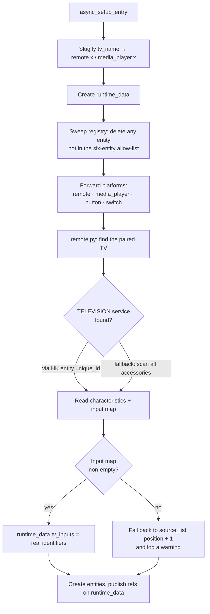

**Why the two routes.** The HomeKit Device entity's `unique_id` is `<pairing>_<aid>_<service iid>`, which points straight at the TELEVISION service — exact, no scanning. That format belongs to another integration, so the 1.x brute-force scan is kept behind it.

**What the input map is.** For each INPUT_SOURCE service linked to the TV, its `CONFIGURED_NAME` and `IDENTIFIER` characteristics, read from memory. `{"TV": 3, "HDMI 2": 7, "Apple TV": 12}`. Identifiers are arbitrary integers, which is why 1.x's `position + 1` was a guess.

**Cost to the TV:** zero packets.

---

## 2. Migration, 1.x → 2.0

**Trigger:** first start after the upgrade, when the stored config entry is version 1.

```mermaid
flowchart TD
    A[async_migrate_entry, version == 1] --> B[Read custom_inputs + homekit_inputs]
    B --> C{command_type?}
    C -->|hap| D["input_9 → source_id: 9"]
    C -->|remote| E["remote.x.Cmd → target + action"]
    C -->|media_player| F["mp.x&#124;App&#124;app → target + action"]
    C -->|media_player_source| G["mp.x&#124;App&#124;input_8 → target + action + source_id: 8"]
    D --> H[explicit 'identifier' field wins if present]
    E --> H
    F --> H
    G --> H
    H --> I[Write options.inputs, bump entry to version 2]
    I --> J[Log the names that had Include off]
```

Every input migrates, included or not — nothing disappears silently. The ones that were excluded are named in the log so you can remove them in one dialog.

---

## 3. Reading power and current input

**Trigger:** the HomeKit Device `media_player` entity changes state. Both of our entities listen independently; neither reads from the other.

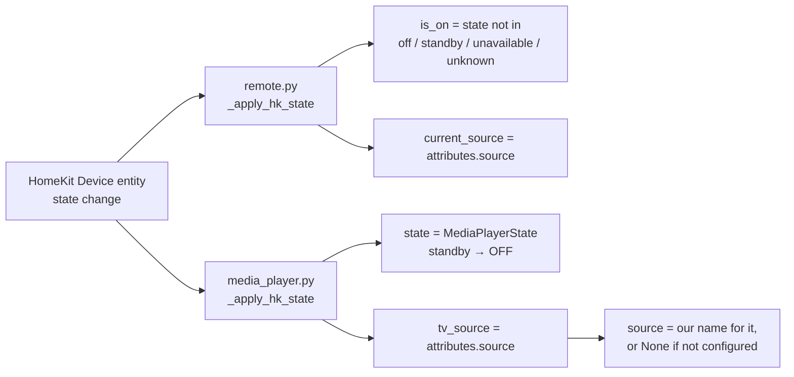

**Two fixes live here.** `is_on` used to be `state == "on"`, so a TV reporting `playing` read as off. And 1.x chained HomeKit Device → remote attributes → media player, so the same fact was copied twice and could disagree with itself mid-update.

`source` returns `None` rather than a raw name that is not in `source_list` — a source outside the list confuses both the HA media card and Apple Home. The raw name stays available as `tv_source`.

---

## 4. Pressing a remote key

**Trigger:** `remote.send_command`, the iOS widget, or the media player's play/pause.

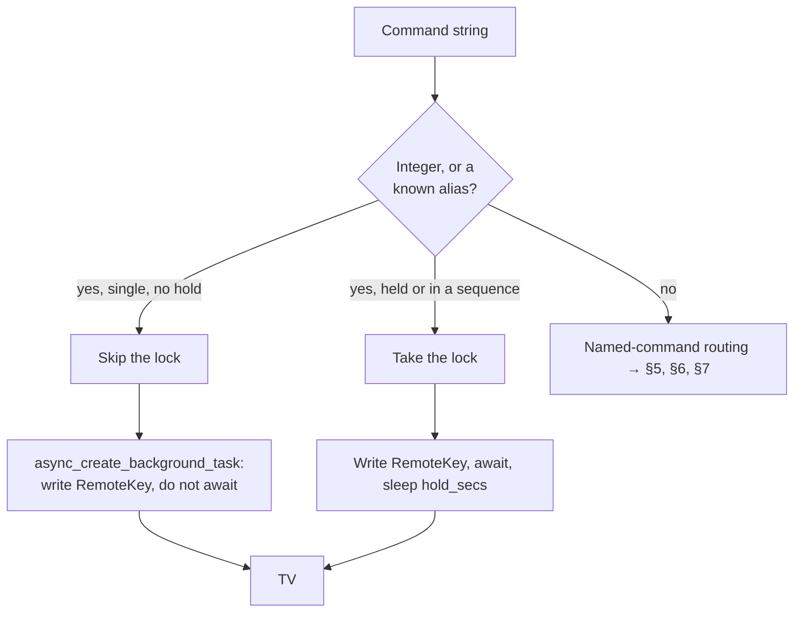

**Why fire and forget.** Waiting for the TV to acknowledge each press makes rapid D-pad taps queue behind each other. TCP already guarantees order. 1.x used `asyncio.ensure_future`, which leaves the task unreferenced and collectable mid-flight — occasionally a press just vanished. `hass.async_create_background_task` keeps the reference.

**Aliases** (`up`, `back`, `home`, `settings`, `rewind`, …) live in `const.COMMAND_ALIASES`. Raw integers still work.

---

## 5. Volume and mute

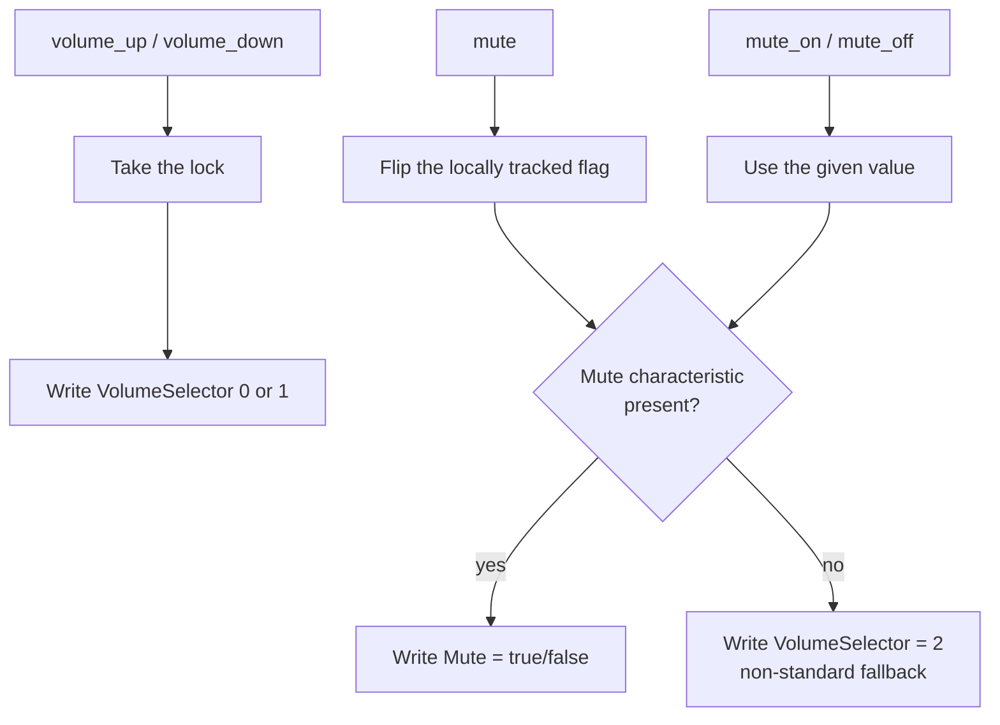

1.x did a `get_characteristics` read before every mute toggle — a round trip to the TV. Mute state is tracked locally now, so it is one write. HomeKit does not report mute back, which makes the value optimistic: `mute_on` / `mute_off` are the deterministic forms.

---

## 6. Switching to a TV input

**Trigger:** `media_player.select_source`, `remote.send_command: input:Name`, the cycle, or Apple Home.

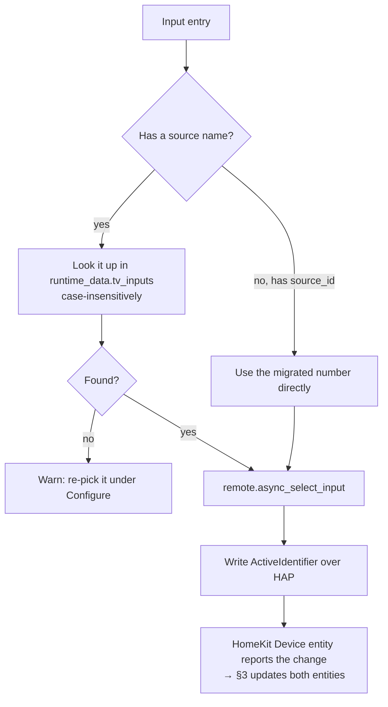

Direct HAP write, kept for latency. What changed is where the number comes from: the accessory description instead of the user's fingers.

---

## 7. Running a shortcut

**Trigger:** the same four things as §6, when the entry has a target entity.

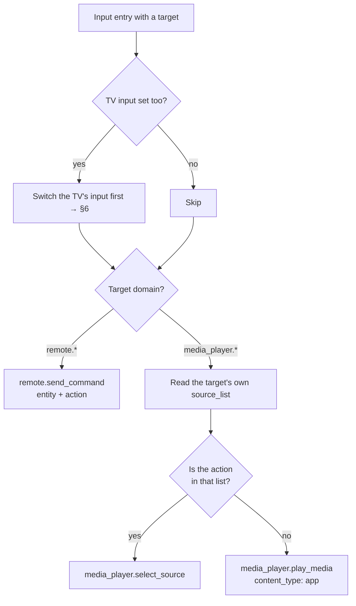

**This is what replaced the two Apple TV switches.** The check at H is made when the shortcut runs, against live state, so it is right for Apple TV, for Bravia, and for anything else — and it stays right if the other integration changes.

All of this is one method, `media_player.async_run_input`. The Configure dialog's Test box calls the same method, so a test is exactly what a save would do.

The call at F/I/J is fire-and-forget by default. Waiting on it is what used to freeze the ⓘ button — see §8. Test passes `blocking=True` so a failure can be reported back into the form.

---

## 8. Cycling inputs

**Trigger:** the widget's ⓘ Info button, or the **Next input** button. Both land on the same method and share one position.

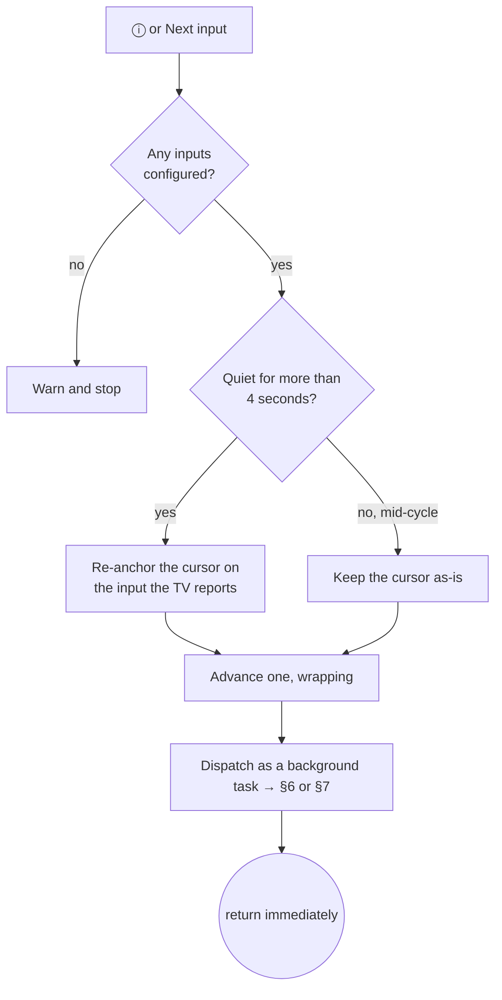

Two separate fixes live in this diagram.

**The freeze.** Step H used to be an `await`. The chain was: HomeKit key event, or the `button.press` service call, awaiting `async_cycle_input`, awaiting `async_run_input`, awaiting a blocking `media_player.select_source`. An Apple TV app launch does not return until the app is actually up — several seconds — and for that whole window Next input sat disabled in the UI and further ⓘ presses did nothing visible. It recovered on its own once the call returned, which is exactly the "annoying, clears after a few seconds" symptom. Dispatching in the background means three presses in a row move three steps, immediately, however slow the far end is.

**The double-step that looked like a stall.** Re-anchoring on the live input is right after a pause — it makes the cycle follow the TV when the input was changed by its own remote or an automation. It is wrong *during* cycling: the TV still reports the input we have not finished leaving, so the cursor snaps back and the next press hands out the same target again. Hence the 4-second window at D.

## 9. Configure → TV inputs

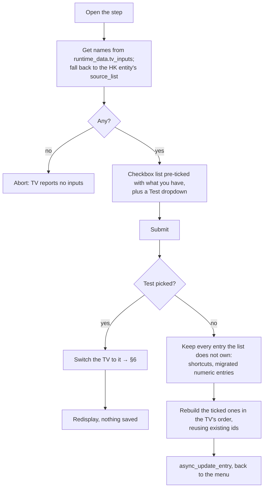

Reusing ids at K means re-ticking an input you already had does not create a duplicate or lose its place. The Test path writes nothing at all.

---

## 10. Configure → Add a shortcut

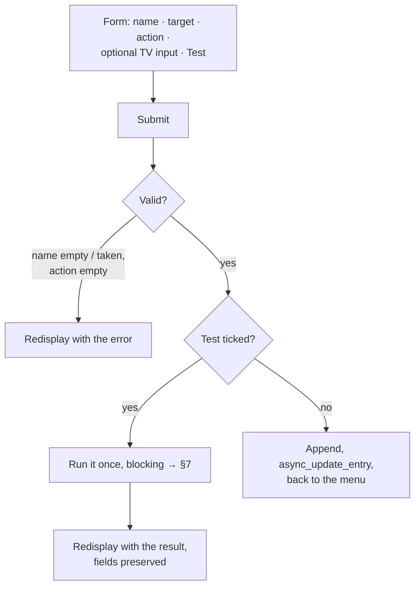

The test path never writes anything, and the duplicate-name check is skipped while testing so you can test a replacement for something you already have.

---

## 11. Configure → Manage

A submenu, because rename, reorder and remove each want a different shape of form.

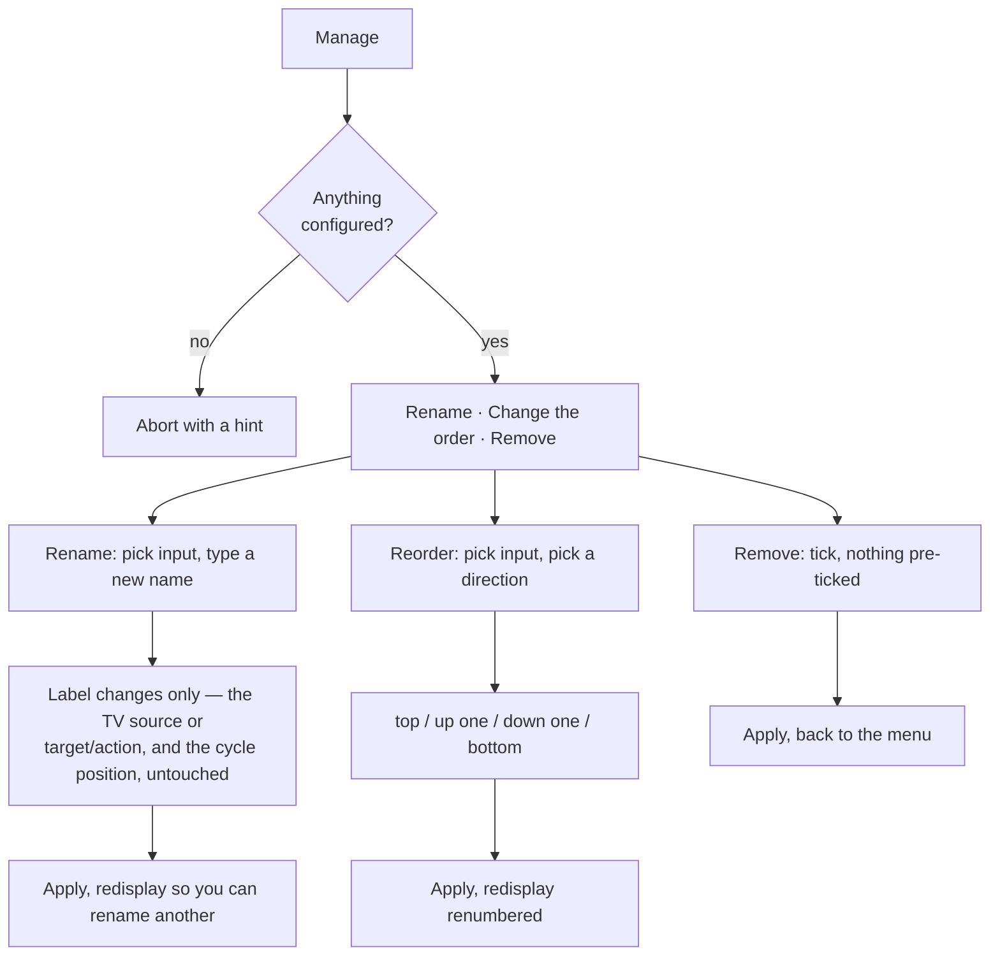

**Why every step writes with `async_update_entry` instead of ending the flow.** Nothing here needs a reload: `media_player.py` reads `options["inputs"]` live on every `source_list` access and every cycle step, so a rename or a move is in effect the moment it is written. Ending the flow would close the dialog after each change — renaming three inputs would mean opening Configure three times. The one thing that does need a nudge is Apple Home, which caches the accessory's input list; that is the **Reload HomeKit Bridge** button, pressed once at the end.

The consequence is that `OptionsFlowWithReload` never fires, since the flow does not end with changed options. That is deliberate.

Reorder redisplays a renumbered list rather than offering a drag-and-drop or an ordered multi-select. One move at a time, seen immediately, converges faster than a widget you have to get right in one go.

---

## 11b. Configure → Manual

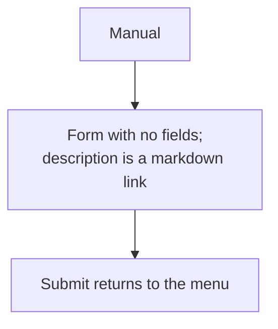

A config flow cannot open a browser tab, so the link is the content. The same URL is behind the ? icon in every dialog header and the Documentation item in the integration's ⋮ menu — all three come from `manifest.json`'s `documentation` field, mirrored as `DOCS_URL` in `const.py`.

---

## 12. Debug switches

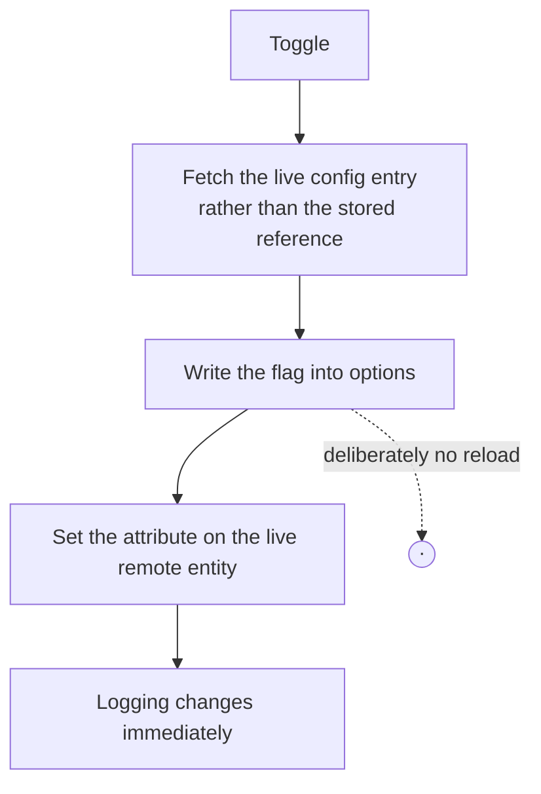

Two things make this safe. The entry is re-read before writing, so toggling both switches in a row does not lose the first write — that was the 1.3.1 bug. And the integration has no config-entry update listener at all, so writing options here is silent. Reloading is the options flow's job, and only the options flow's.

---

## 13. Reload HomeKit Bridge

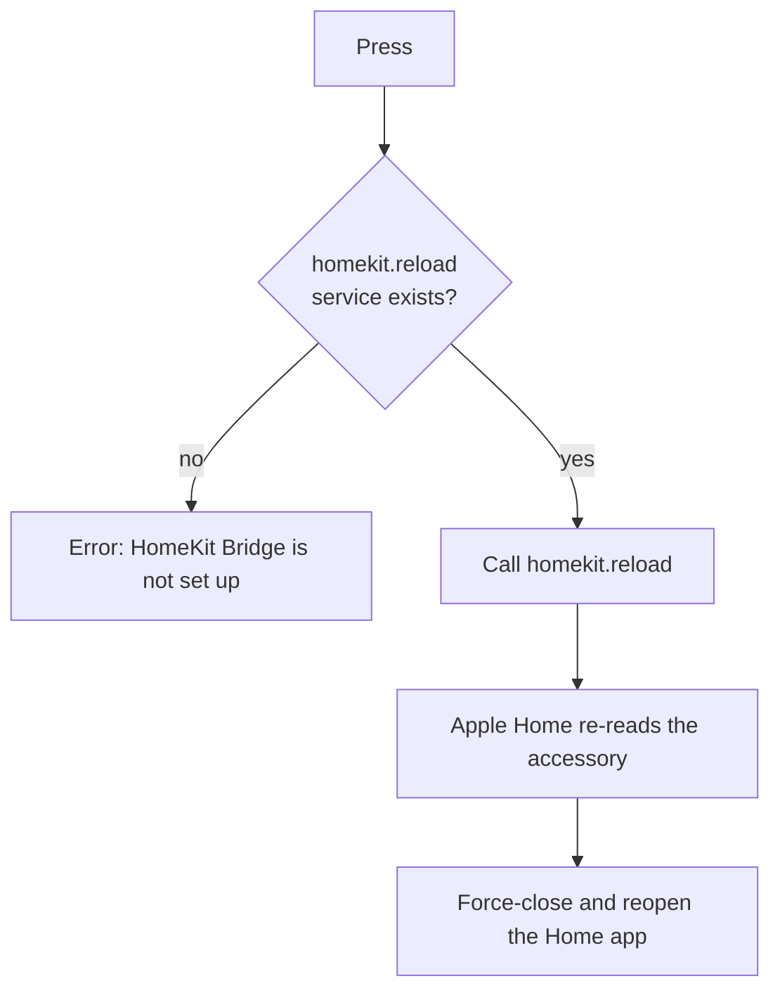

In 1.7.0 this button also reloaded the integration first, because saving an input did not. It does not need to any more — the options flow reloads when it saves. One job, one call.

---

## 14. Unload

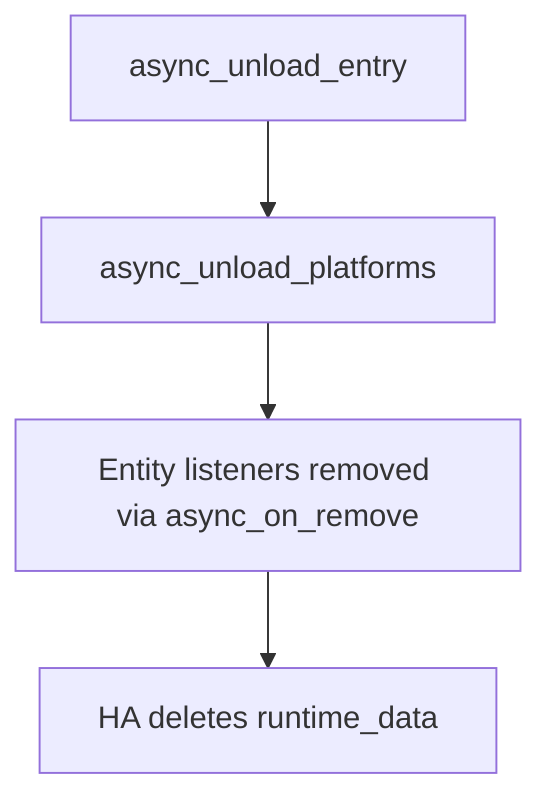

Nothing to pop by hand. `hass.data` needed manual cleanup and was a leak source; `runtime_data` is removed by Home Assistant.

---

## Where each fact lives

| Fact | Source of truth | Read how often |
|---|---|---|
| TV on/off | HomeKit Device entity state | On change |
| Current input | HomeKit Device entity `source` attribute | On change |
| Input name → identifier | Accessory INPUT_SOURCE services | Once per setup |
| Which inputs are shown | `options["inputs"]` | Live, every access |
| Mute | Local, optimistic | — |
| Debug flags | `options` + live entity attribute | On toggle |

Nothing in that table is a request to the TV.
